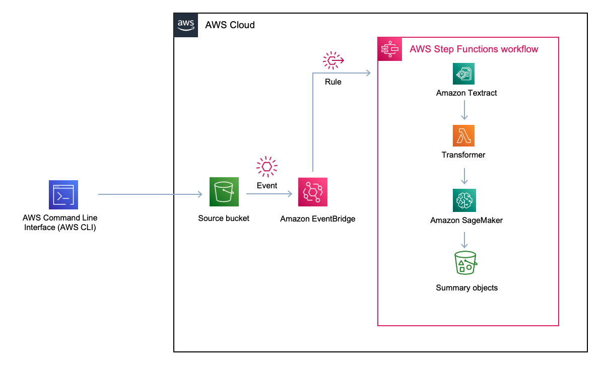
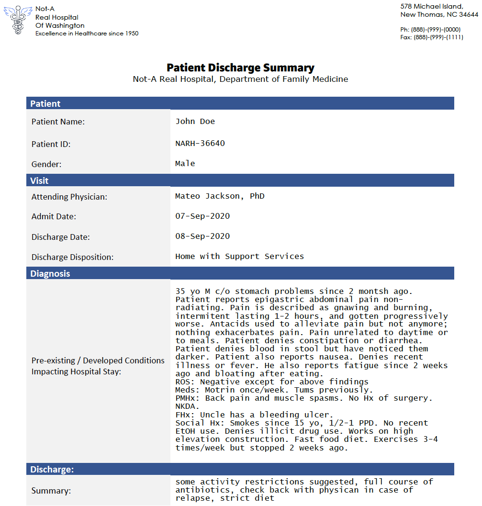

## Summarize with Foundational Model using Serverless
This sample application is part of an AWS Machine Learning blog on [Intelligent Document Processing using GenAI](https://aws.amazon.com/blogs/machine-learning/enhancing-aws-intelligent-document-processing-with-generative-ai).

## Architecture



## Deploy the sample application

### Prerequisites
To run the sample application, you will need:
 - [AWS SAM CLI](https://docs.aws.amazon.com/serverless-application-model/latest/developerguide/install-sam-cli.html)
 - [AWS CLI](https://aws.amazon.com/cli/)
 - Your own Foundational Model running in SageMaker Endpoint which the state machine will invoke

### Deploy
```bash
sam build && sam deploy --guided
```

## Testing the application
The sample app has a synthetic medical discharge document which we will summarize. The document looks like:



Take the source bucket name from the SAM output and run:

```bash
aws s3 cp ./dischargesummary.png s3://<sourcebucketname>
```

Visualize the workflow in AWS Step Functions console. Check the json file in the destination bucket. The summary object in this sample is a JSON file as below:

```json
{
  "summary": [
    "John Doe has been diagnosed with a bleeding ulcer. He will be on a strict diet and activity restrictions."
  ],
  "tables": [
    {
      "key": "Ph: ",
      "value": "(888)-(999)-(0000) "
    },
    {
      "key": "Fax: ",
      "value": "(888)-(999)-(1111) "
    },
    {
      "key": "Patient ",
      "value": ""
    },
    {
      "key": "Patient Name: ",
      "value": "John Doe "
    },
    {
      "key": "Patient ID: ",
      "value": "NARH-36640 "
    },
    {
      "key": "Gender: ",
      "value": "Male "
    },
    {
      "key": "Visit ",
      "value": ""
    },
    {
      "key": "Attending Physician: ",
      "value": "Mateo Jackson, PhD "
    },
    {
      "key": "Admit Date: ",
      "value": "07-Sep-2020 "
    },
    {
      "key": "Discharge Date: ",
      "value": "08-Sep-2020 "
    },
    {
      "key": "Discharge Disposition: ",
      "value": "Home with Support Services "
    },
    {
      "key": "Diagnosis ",
      "value": ""
    },
    {
      "key": "Pre-existing / Developed Conditions Impacting Hospital Stay: ",
      "value": "35 yo M c/o stomach problems since 2 montsh ago. Patient reports epigastric abdominal pain non- radiating. Pain is described as gnawing and burning, intermitent lasting 1-2 hours, and gotten progressively worse. Antacids used to alleviate pain but not anymore; nothing exhacerbates pain. Pain unrelated to daytime or to meals. Patient denies constipation or diarrhea. Patient denies blood in stool but have noticed them darker. Patient also reports nausea. Denies recent illness or fever. He also reports fatigue since 2 weeks ago and bloating after eating. ROS: Negative except for above findings Meds: Motrin once/week. Tums previously. PMHx: Back pain and muscle spasms. No Hx of surgery. NKDA. FHx: Uncle has a bleeding ulcer. Social Hx: Smokes since 15 yo, 1/2-1 PPD. No recent EtOH use. Denies illicit drug use. Works on high elevation construction. Fast food diet. Exercises 3-4 times/week but stopped 2 weeks ago. "
    },
    {
      "key": "Discharge: ",
      "value": ""
    },
    {
      "key": "Summary: ",
      "value": "some activity restrictions suggested, full course of antibiotics, check back with physican in case of relapse, strict diet "
    }
  ],
  "forms": ""
}
```

## Cleanup

To delete the sample application that you created, use the AWS SAM CLI. Assuming you used your project name for the stack name, you can run the following:

```bash
sam delete --stack-name serverless-summarize-foundational-model
```
## Security

See [CONTRIBUTING](CONTRIBUTING.md#security-issue-notifications) for more information.

## License

This library is licensed under the MIT-0 License. See the LICENSE file.

